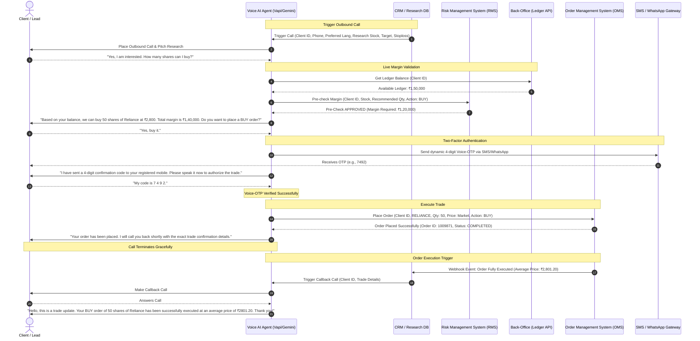

# Enterprise Voice AI Architecture & Implementation Plan: Indian Stock Broking

This implementation plan provides a comprehensive architectural blueprint and a step-by-step guide to setting up a production-ready, highly guardrailed **Voice AI Agent** for stock research delivery, pre-order validation, authentic client confirmation, order execution, and post-trade callbacks.

---

## 1. Executive Summary & Goals

The target system is a high-performance, low-latency, and highly secure Voice AI designed for an Indian stock brokerage. It acts as an automated, multilingual sales trader and research advisor. 

### Key Performance Metric
*   **Call-to-Trade Conversion Rate**: Maximizing the number of high-quality research calls that successfully result in compliant, error-free trades executed by clients.

### Operational Guardrails
1.  **Zero-Error Order Entry**: Absolute validation of order parameters (Action, Script, Qty, Price, Order Type, Product Code) before any submission.
2.  **SEBI & Exchange Compliance**: Mandated call recording, clear risk disclosures, separate advisory consent, and explicit order confirmation logs.
3.  **Real-Time Back-Office & RMS Validation**: Live checks on client ledger balances, margin requirements, segment activation, and stock ban status.
4.  **Authentic Client Confirmation**: Dynamic 2FA (Voice-OTP or IVR confirmation) to prevent unauthorized trading.
5.  **Proactive Post-Trade Callback**: Automated outbound callback to relay execution status (fully executed, partially filled, rejected with reasons).

---

## 2. Target Technology Stack

To achieve a conversational latency of under **800ms** (essential for a natural voice call experience) in India, the following tech stack is recommended:

```
  +------------------+       SIP Trunk        +-----------------------+
  |  Indian Telecom  |<======================>|   Telephony Carrier   |
  |  (Jio/Airtel)    |                        |   (Exotel/Ozonetel)   |
  +------------------+                        +-----------+-----------+
                                                          |
                                                          | WebSocket Audio
                                                          v
  +-------------------------------------------------------+-----------+
  |                    Real-Time Audio Orchestrator                   |
  |                      (Vapi.ai / Retell AI)                        |
  +----+----------------------+-----------------------+-----------+---+
       |                      |                       |           |
       | Webhook (JSON)       | Audio Stream          | TTS Audio |   | LLM Prompts
       v                      v                       v           |   (JSON / Text)
  +----+--------+      +------+-------+      +--------+------+    |   v
  | Back-Office |      | Speech-to-   |      | Text-to-      |    +---+-------+
  |  & RMS API  |      | Text (STT)   |      | Speech (TTS)  |    | Gemini    |
  | (Kite/NEST/ |      | (Azure /     |      | (ElevenLabs / |    | 1.5 Flash |
  |  SmartAPI)  |      | Google V2)   |      | Azure Neural) |    +-----------+
  +-------------+      +--------------+      +---------------+
```

### Telephony & Audio Streaming (CPaaS)
*   **Provider**: **Exotel** or **Ozonetel** (highly recommended for domestic Indian routing, TRAI compliance, DND filtering, and domestic CLI delivery) or **Twilio** via an Indian Virtual Number.
*   **Audio Protocol**: WebSockets streaming bidirectionally (8kHz / 16kHz linear PCM).

### Audio Orchestration (State & Latency Management)
*   **Platform**: **Vapi.ai** or **Retell AI**. These platforms orchestrate the complex connections between the telephony provider, STT, LLM, and TTS. They handle silence detection, user interruption handling, and connection retries out-of-the-box, saving months of custom engineering.

### Cognitive & NLP Engines
*   **Speech-to-Text (STT)**: **Microsoft Azure Speech Service** or **Google Cloud Speech-to-Text V2** configured for Indian accents and regional languages (`en-IN` / `hi-IN` / `gu-IN`). Excellent at understanding code-mixed inputs (e.g., Hinglish / Gujlish).
*   **LLM (Brain)**: **Gemini 1.5 Flash**. Its fast response times, outstanding reasoning capabilities, strict compliance with system prompts, and native multilingual support make it perfect for running the conversational state machine and safety guardrails.
*   **Text-to-Speech (TTS)**: **ElevenLabs Multilingual V2** (extremely lifelike and emotionally expressive in Hindi/Gujarati) or **Azure Neural TTS** (excellent, highly reliable voices for Indian English, Hindi, and Gujarati).

---

## 3. Comprehensive System Architecture



---

## 4. Indian Broker Back-Office & RMS Integration API Contracts

To connect the Voice AI with your existing backend (e.g., Omnesys NEST, Dhan, Angel One SmartAPI, or Kite Connect), you must implement the following three microservice endpoints in your secure middleware.

### 4.1. Ledger Balance Check Endpoint
*   **Purpose**: Get real-time withdrawable and margin cash balances.
*   **HTTP Method**: `GET`
*   **Endpoint**: `https://api.yourbroker.com/v1/client/ledger?client_id=CLIENT_123`
*   **Response Payload**:
    ```json
    {
      "status": "success",
      "data": {
        "client_id": "CLIENT_123",
        "ledger_balance": 150000.00,
        "available_margin": 150000.00,
        "collateral_value": 0.00,
        "currency": "INR"
      }
    }
    ```

### 4.2. Pre-Order RMS Verification Endpoint
*   **Purpose**: Verify if the planned order complies with exchange rules and client margin thresholds before presenting it to the client. This avoids pitching trades that will fail.
*   **HTTP Method**: `POST`
*   **Endpoint**: `https://api.yourbroker.com/v1/rms/validate`
*   **Request Payload**:
    ```json
    {
      "client_id": "CLIENT_123",
      "exchange": "NSE",
      "tradingsymbol": "RELIANCE-EQ",
      "transaction_type": "BUY",
      "quantity": 50,
      "price_type": "MARKET",
      "price": 0.0,
      "product": "CNC"
    }
    ```
*   **Response Payload (Approved)**:
    ```json
    {
      "status": "APPROVED",
      "margin_required": 140000.00,
      "margin_available": 150000.00,
      "shortfall": 0.00,
      "reason": "Sufficient funds available. Stock is liquid."
    }
    ```
*   **Response Payload (Rejected)**:
    ```json
    {
      "status": "REJECTED",
      "margin_required": 280000.00,
      "margin_available": 150000.00,
      "shortfall": 130000.00,
      "reason": "Insufficient Margin. Please add ₹1,30,000 to place this trade."
    }
    ```

### 4.3. Order Execution Endpoint (OMS)
*   **Purpose**: Place the actual trade into the market.
*   **HTTP Method**: `POST`
*   **Endpoint**: `https://api.yourbroker.com/v1/orders/place`
*   **Request Payload**:
    ```json
    {
      "client_id": "CLIENT_123",
      "exchange": "NSE",
      "tradingsymbol": "RELIANCE-EQ",
      "transaction_type": "BUY",
      "quantity": 50,
      "price_type": "MARKET",
      "price": 0.00,
      "product": "CNC",
      "auth_token_2fa": "7492",
      "voice_recording_url": "https://voice-logs.yourbroker.com/recordings/call_9827361.mp3"
    }
    ```
*   **Response Payload**:
    ```json
    {
      "status": "success",
      "data": {
        "order_id": "202605230009871",
        "status": "COMPLETE",
        "average_price": 2801.20,
        "quantity_filled": 50
      }
    }
    ```

---

## 5. Strict SEBI & Operational Guardrails

Adherence to financial regulations and operational accuracy is critical to avoiding heavy fines from SEBI, exchange complaints, and client disputes.

### 5.1. SEBI Compliance & Legal Safety
*   **Mandatory Call Recording**: The telephony system (Exotel/Ozonetel) *must* record 100% of the call duration. The URL of the voice recording must be appended to the order audit trail in your back-office database.
*   **Research Disclosures**: At the beginning of the call, the Voice AI must state a compliance disclaimer:
    > *"This call contains equity research recommendations from [Broker Name]. Investing in the stock market is subject to market risks. Please read all related documents carefully."*
*   **Advisory Opt-In Consent**: The client must explicitly confirm they want to hear the research call before the AI pitches the stock. If the client says "No" or "Busy", the AI must politely end the call immediately.

### 5.2. Dialog & Intent Validation Guardrail
To ensure the LLM never misinterprets the user’s order parameters (e.g., buying the wrong stock or executing an incorrect quantity):
*   **The 6-Parameter Rule**: The Voice AI *must* explicitly extract and validate the following 6 fields:
    1.  **Trading Symbol** (e.g., "Reliance Industries")
    2.  **Action** (e.g., "BUY" or "SELL")
    3.  **Quantity** (e.g., "50 shares")
    4.  **Exchange** (e.g., "NSE")
    5.  **Product Type** (e.g., "CNC" for Delivery, "MIS" for Intraday)
    6.  **Order Type & Price** (e.g., "Market Price" or "Limit Price of ₹2,800")
*   **Active confirmation / Readback**: The system must synthesize the exact order details back to the user:
    > *"I have drafted a BUY order for 50 shares of Reliance Industries on the NSE for Delivery at the Market price. Do you confirm this order? Please say 'Yes, I confirm' or say 'Cancel' to stop."*
*   **Explicit Acoustic Consent Matching**: The downstream execution middleware should perform simple string matching on the final transcript response (e.g., ensuring words like "confirm", "yes", "place", "haan", "ha" are present in the final sentence, while blocking words like "no", "hold", "stop", "change", "nathi").

### 5.3. Financial Protection Guardrails
*   **Maximum Limit Per Voice Order**: Prevent massive fat-finger trades by setting a hard limit per voice trade (e.g., maximum ₹50,000 for standard leads, ₹5,00,000 for verified KYC clients).
*   **Penny Stock / Ban List Blocking**: If the research database or RMS marks a stock as "Z Category", "GSM/ASM list", or "F&O Ban Period", the Voice AI must block any order placement and inform the client.
*   **Authentic 2FA Confirmation (Dynamic Voice-OTP)**:
    1.  When the user says "Yes, place the trade", the system generates a random 4-digit OTP.
    2.  The middleware sends this OTP to the client's registered mobile number via SMS and WhatsApp.
    3.  The Voice AI prompts: *"To authorize this trade securely, please speak the 4-digit verification code sent to your mobile phone."*
    4.  The client speaks the OTP.
    5.  The STT transcribes the number, and the LLM/Middleware validates it against the active OTP. This prevents unauthorized calls, accidental confirmations, or family members placing trades.

---

## 6. Step-by-Step Implementation Roadmap

Below is a detailed guide on how to build and launch this system from scratch.

```
+----------------------------------------------------------------------------+
|                          Phase 1: API Middleware                           |
|  Build secure wrappers for Ledger, RMS Margin Validation, and OMS Orders.   |
+-------------------------------------+--------------------------------------+
                                      |
                                      v
+----------------------------------------------------------------------------+
|                       Phase 2: Telephony Integration                       |
|  Configure Exotel/Ozonetel with SIP Trunking and real-time audio streams.   |
+-------------------------------------+--------------------------------------+
                                      |
                                      v
+----------------------------------------------------------------------------+
|                      Phase 3: Conversational Pipeline                      |
|  Set up Vapi/Retell with Azure STT, Gemini 1.5 Flash LLM, and ElevenLabs. |
+-------------------------------------+--------------------------------------+
                                      |
                                      v
+----------------------------------------------------------------------------+
|                         Phase 4: Prompt Engineering                        |
|  Draft System Prompts for Hindi, Gujarati & English dialog management.     |
+-------------------------------------+--------------------------------------+
                                      |
                                      v
+----------------------------------------------------------------------------+
|                     Phase 5: Secure 2FA & Order Loop                       |
|  Integrate SMS/WhatsApp OTP and link final confirmations to order placement.|
+-------------------------------------+--------------------------------------+
                                      |
                                      v
+----------------------------------------------------------------------------+
|                       Phase 6: Callback Notification                       |
|  Hook trade execution webhooks to outbound dialer for confirmation calls.  |
+----------------------------------------------------------------------------+
```

### Phase 1: API Middleware Development
1.  Develop backend API wrappers for your broker's Core trading terminal (Kite, NEST, SmartAPI, etc.).
2.  Expose three HTTPS REST endpoints: `/client/ledger`, `/rms/validate`, and `/orders/place`.
3.  Protect these endpoints with internal mTLS (mutual TLS) or secure API Gateway bearer tokens.
4.  Configure logging to store all payload requests, response logs, and order IDs.

### Phase 2: Telephony Setup
1.  Purchase an outbound Virtual/DID Phone Number with high concurrent channel capabilities from Exotel or Ozonetel.
2.  Enable call recording (TRAI compliant) and fetch the S3 bucket access credentials where the recordings will be stored.
3.  Set up an outbound SIP Trunk pointing to your audio orchestration server.

### Phase 3: Speech & AI Orchestration Setup
1.  Create an account on **Vapi.ai** or **Retell AI**.
2.  Configure a new Agent:
    *   **STT**: Select Microsoft Azure or Google Speech-to-Text V2. Set language mode to Indian English (`en-IN`), Hindi (`hi-IN`), and Gujarati (`gu-IN`). Enable multi-language detection or pass the client's language preference dynamically on call initiation.
    *   **LLM**: Choose Custom LLM or Gemini. Point the webhook URL to your custom middleware containing the prompt and back-office API links.
    *   **TTS**: Select Azure Neural TTS or ElevenLabs. Configure high-quality regional voices (e.g., Azure's `hi-IN-MadhurNeural` for Hindi, `gu-IN-DhwaniNeural` for Gujarati, or ElevenLabs custom clone voices).
3.  Bind the Exotel virtual number to your Vapi/Retell dashboard.

### Phase 4: Prompt Engineering & Dialog Flow (Multilingual Prompt)
Implement the core prompt using Gemini 1.5 Flash. The system prompt must force the LLM to act strictly as a professional, SEBI-compliant trading assistant. 

Below is an optimized boilerplate prompt for the Voice AI:

```markdown
You are a highly professional, SEBI-compliant Voice AI Sales Trader for [Broker Name]. 
Your objective is to present a stock research call to the client, verify their ledger balance and risk parameters, and take an authentic confirmation before executing a trade.

### Supported Languages:
- English, Hindi (Hinglish allowed), and Gujarati (Gujlish allowed).
- Respond in the language preferred by the client. If they speak Hindi, respond in fluent Hindi/Hinglish. If they speak Gujarati, respond in Gujarati/Gujlish.

### Strict Call Flow Stages:
1. GREETING & RESEARCH PITCH: 
   - Greet the client politely (e.g., "Hello, this is [Broker Name] Research Team. May I speak with Mr. Rajeev?").
   - Announce mandatory risk disclaimer immediately.
   - Present the research call clearly (e.g., "Our research desk has a BUY recommendation on Reliance Industries at current market price of ₹2800 with a target of ₹3000 and stop loss of ₹2700. Would you be interested in placing this trade?").
2. BALANCE & RMS CHECK:
   - If they say yes, immediately call the `/client/ledger` and `/rms/validate` tools in the background.
   - If ledger balance is sufficient: "Excellent. Your available ledger balance is ₹1.5 Lakhs, which is well within our margin requirement of ₹1.4 Lakhs."
   - If ledger balance is insufficient: "Sir/Madam, the order requires a margin of ₹2.8 Lakhs, but your available balance is ₹1.5 Lakhs. Would you like to buy a smaller quantity of 25 shares instead, or would you like me to send you a quick UPI payment link to add funds?"
3. SECURE 2FA AUTHORIZATION:
   - Once they agree to the specific quantity and price, say: "To authorize this trade securely, I am sending a 4-digit code to your registered mobile number right now. Please tell me the code once you receive it."
   - Trigger the SMS/WhatsApp OTP API immediately.
   - Wait for the user to speak the code. Validate it. If incorrect, ask them to check and repeat. Do not proceed until verified.
4. ORDER CONFIRMATION & PLACEMENT:
   - Repeat the exact trade parameters (6-Parameter Rule): "Confirming a BUY order of 50 shares of Reliance Industries on NSE at Market price for Delivery. Do you confirm?"
   - If they say yes, execute the `/orders/place` tool.
   - Say: "Your order has been placed successfully. I will call you back shortly with the exact execution details. Thank you for trading with [Broker Name]!"
   - Gracefully disconnect the call.

### Safety Rules:
- NEVER place an order without verifying the 4-digit OTP.
- NEVER execute trades on illiquid or banned stocks.
- If the user is confused or speaks an unsupported language, politely route them to a human trader: "I am routing your call to our human representative, please hold."
- Speak clearly, keep your responses concise (under 2 sentences per turn), and do not rush the client.
```

### Phase 5: Voice-OTP & Order Execution API Loop
1.  Configure the Vapi/Retell agent's Custom Webhook to listen to functional calls (Tools).
2.  When the LLM triggers the `send_otp` tool, generate a 4-digit code in your middleware, cache it in Redis with a 3-minute expiration, and trigger an SMS/WhatsApp gateway (e.g., Twilio, RouteMobile, or Gupshup).
3.  When the user speaks the OTP, let the LLM trigger the `verify_otp` tool. If the middleware returns `valid: true`, let the LLM proceed to the final confirmation.
4.  After the client confirms the order parameters, the LLM triggers `place_order`. Your middleware maps the voice transcript to the broker's trading API and returns the execution status.

### Phase 6: Automated Post-Trade Callback Execution
1.  Set up an event listener/webhook in your back-office systems. Whenever a trade status updates to `COMPLETE` or `REJECTED`, publish a message to a RabbitMQ/Kafka queue.
2.  A worker service picks up the message and uses the Exotel/Ozonetel API to trigger an **Outbound Voice Call** to the client.
3.  When the client answers, connect them to a simple Vapi/Retell outbound campaign agent.
4.  The Agent says:
    > *"Hello, this is a trade update from [Broker Name]. Your BUY order of 50 shares of Reliance Industries has been successfully executed on the NSE at an average price of ₹2,801.20. Your updated ledger balance is ₹9,880. Thank you for trading with us!"*

---

## 7. Verification & Testing Plan

To ensure absolute safety, execute the following testing hierarchy before going live:

### 7.1. Sandbox Testing (Local & Staging Environment)
*   **Virtual Account Sandbox**: Conduct 100+ simulated calls using a virtual paper trading account. Verify that the Voice AI extracts client intents correctly, and that ledger values map correctly without real money at stake.
*   **OTP Fail-Safe Test**: Input incorrect OTPs, speak garbled numbers, and verify that the AI refuses to place the order and asks for re-entry.
*   **Ambient Noise Testing**: Simulate calls with background noise (traffic, office chatter, low network coverage) to ensure Azure/Google STT can still accurately filter out the voice and correctly transcribe numbers.

### 7.2. Compliance Audit
*   **Mandatory Call Recording Audit**: Place 10 calls, check the Exotel dashboard, and verify that 100% of the calls have accessible MP3 recording links.
*   **Language Check**: Conduct test calls in Hindi and Gujarati. Ensure the TTS pronunciation of financial terms like "Ledger", "Shares", "Limit Price" are clear, professional, and natural in the regional languages.

### 7.3. Live Pilot Phase
*   **Internal Group Testing**: Roll out to 10 internal employees/brokers. Place live ₹1 trades in liquid stocks (e.g., 1 share of YES BANK or ITC) to check end-to-end integration latency, SMS OTP delivery speeds, and actual exchange fill status.
*   **Restricted Production Rollout**: Enable for the top 50 trusted active trading clients who opt-in, with a maximum daily trading limit of ₹10,000 per client, before expanding to the general client base.
